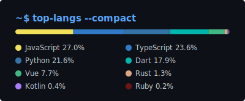

<!-- ============================================ -->
<!--  GitHub Profile README for mitsa-ng (Nati)   -->
<!--  Version française · défaut : README.md      -->
<!-- ============================================ -->

[繁體中文](./README.md) · [English](./README.en.md) · [日本語](./README.ja.md) · **Français**

 

## 👋 À propos

- 🔭 Focalisé sur les **systèmes full-stack**, l'**IA embarquée** et les **jeux multijoueurs**
- 🔐 **La vie privée est une fonctionnalité, pas un réglage** — si ça peut tourner sur l'appareil, pas besoin du cloud
- 🚢 Devise : **livrer d'abord, peaufiner ensuite**

 

## 🚀 Projets phares

|     | projet | ce que ça fait | stack |
| :-: | :----- | :------------- | :---- |
| 🔐 | **[pdiary](https://github.com/mitsa-ng/pdiary)** | Journal vocal IA axé sur la confidentialité — parlez, Whisper transcrit sur l'appareil, un LLM local réécrit le ton, le tout chiffré en AES-256-GCM. **Rien ne quitte jamais l'appareil.** | `Flutter` `whisper.cpp` `llama.cpp` |
| ⛏️ | **[mcgit](https://github.com/mitsa-ng/mcgit)** | `git pull` / `git push` — mais pour des mondes Minecraft. Un verrou distribué garantit un seul hôte à la fois ; l'historique des versions vit dans Postgres. | `Python` `Neon Postgres` |
| 🧩 | **[block-puzzle](https://github.com/mitsa-ng/block-puzzle)** | PWA de puzzle multijoueur avec replays — les salons tournent sur Cloudflare Durable Objects, jouable hors ligne. | `JavaScript` `Cloudflare Workers` `PWA` |
| ✍️ | **[Project-Eat](https://github.com/mitsa-ng/Project-Eat)** | Outil d'annotation de rédactions — entrée caméra/scan → OCR → pipeline hybride NLP + LLM qui corrige automatiquement des rédactions en anglais. | `Python` `OCR` `LLM` |
| 🖥️ | **[website](https://github.com/mitsa-ng/website)** | Pas un simple site perso — un système à trois niveaux : site public Next.js + console d'admin Electron + service de rendu en arrière-plan. | `Next.js` `Electron` `TypeScript` |
| 📊 | **[OmniBoard](https://github.com/mitsa-ng/OmniBoard)** | Application de tableaux full-stack — front en TypeScript, back en Rust, entièrement conteneurisée. → [live](https://omniboard-app.vercel.app) | `TypeScript` `Rust` `Docker` |

<b>📦 encore plus d'expériences au labo</b>

 

- 🤖 **[omniflow](https://github.com/mitsa-ng/omniflow)** — automatisation de flux multiplateforme : Web + Android natif (Capacitor/Kotlin) + relais OAuth + API Gemini
- 🀄 **[six-people-majon](https://github.com/mitsa-ng/six-people-majon)** — mahjong taïwanais à 6 joueurs en synchro distante : état géré par l'hôte, moteur de règles complet (chi/pong/kang/hu)
- ♟️ **[chess](https://github.com/mitsa-ng/chess)** — des échecs dans le navigateur → [live](https://mitchess.vercel.app)
- 🅿️ **[parkwhere](https://github.com/mitsa-ng/parkwhere)** — chercheur de places de parking construit avec Next.js → [live](https://parkhuh.vercel.app)
- 🎛️ **[ichisys](https://github.com/mitsa-ng/ichisys)** — appli full-stack Vue + Python, livrée en Web *et* en desktop Electron, parité dev/prod via Docker → [live](https://ichisys.vercel.app)
- 🎵 **[maiplayerprofile](https://github.com/mitsa-ng/maiplayerprofile)** — générateur de cartes de joueur maimai, déployé sur Hugging Face Spaces (Gradio)
- 📺 **[yt-TV](https://github.com/mitsa-ng/yt-TV)** — YouTube TV (Leanback) en client desktop Electron
- 📝 **[MarkDownEditor](https://github.com/mitsa-ng/MarkDownEditor)** — éditeur Markdown léger pour Windows
- 📼 **[anime1ArchiveTool](https://github.com/mitsa-ng/anime1ArchiveTool)** — archiveur CLI avec ffmpeg embarqué
- 🗂️ **[robocopyTool](https://github.com/mitsa-ng/robocopyTool)** — wrapper Python autour de robocopy pour la synchro de fichiers

 

## 🛠️ Stack technique

**langages**

**frameworks & applications**

**IA embarquée & sécurité**

   

**infra & déploiement**

 

## 📊 Stats GitHub

<!-- Add your links here when ready:

-->

